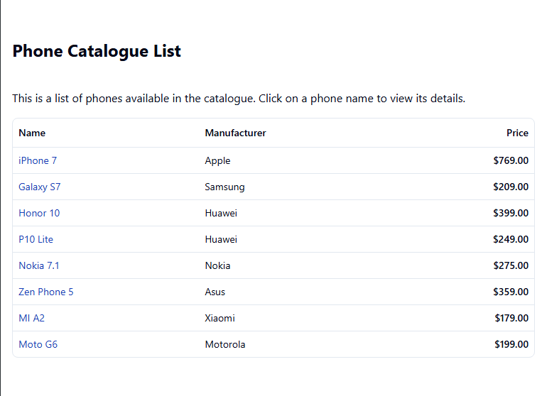
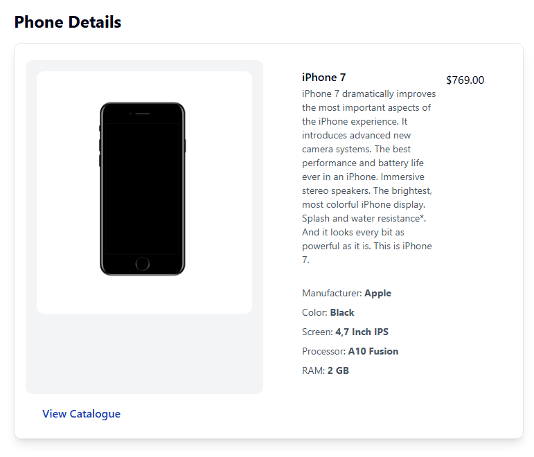
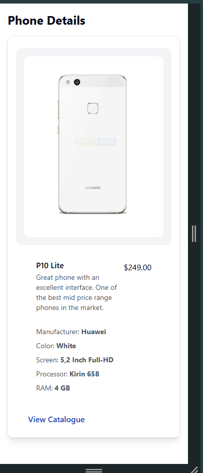

# 📱 Phone Catalogue – Monorepo

> **A Next-Gen Fullstack React SSR App. Built with [TanStack Start](https://tanstack.com/start), Tailwind, Vitest, and Docker for modern DX and rapid iteration.  
> Engineered for production, testing, and collaboration.**

## Preview

- **Home (" / ")**:



- **Detail (" /phone/id ")**:





---

## 🧬 Stack Overview

| Layer           | Technology                                                                                                           | Description                                        |
| --------------- | -------------------------------------------------------------------------------------------------------------------- | -------------------------------------------------- |
| **Framework**   | [TanStack Start](https://tanstack.com/start)                                                                         | Modern React framework for SSG, SSR, API & SPA     |
| **Styling**     | [Tailwind CSS](https://tailwindcss.com)                                                                              | Utility-first, rapid CSS styling                   |
| **SSR/Backend** | [Nitro](https://nitro.unjs.io) via TanStack                                                                          | Fast Node SSR & API (Edge/serverless ready)        |
| **API Routes**  | `/routes/api/*`                                                                                                      | Handled by Nitro, accessible via `/api/` endpoints |
| **Testing**     | [Vitest](https://vitest.dev), [React Testing Library](https://testing-library.com/docs/react-testing-library/intro/) | Fast unit/integration tests, DX focus              |
| **Dev Tools**   | [pnpm](https://pnpm.io), [Docker](https://docs.docker.com/)                                                          | Fast package manager & reproducible builds         |
| **Components**  | [shadcn/ui](https://ui.shadcn.com/docs/components)                                                                   | UI Primitive Components Library Generator          |
---

## 🚦 Local Development

1. **Install dependencies (with [pnpm](https://pnpm.io)):**

   ```sh
   pnpm install
   ```

2. **Start Dev Server:**

   ```sh
   pnpm dev
   ```

   - Runs at [http://localhost:3000](http://localhost:3000) (by default)
   - Hot reloads, uses Tailwind

3. **Run Tests (Vitest):**

   ```sh
   pnpm test
   ```

   - Blazing fast, with watch mode, TS coverage

4. **Build for Production (SSG + SSR):**

   ```sh
   pnpm build
   ```

5. **Start Production Server:**

   ```sh
   pnpm start
   ```

   - Uses the built output (`.output/` directory)
   - Handles SSR + API routes

---

## 🐳 Docker Setup

1. **Build Docker Image:**

   ```sh
   docker build -t phone-catalogue .
   ```

2. **Run Docker Container:**

   ```sh
   docker run --rm -p 3000:3000 phone-catalogue
   ```

   - App runs at [http://localhost:3000](http://localhost:3000)
   - Handles both SSR HTML and API routes

3. **Multi-Stage Build:**
   - **Stage 1:** Installs deps, builds app
   - **Stage 2:** Runs production server (small image, optimized for Node SSR)
   - See `Dockerfile` for more info.

4. **Run via Compose:**
   - **DEV** `pnpm run docker:compose:dev`
   - **PROD** `pnpm run docker:compose`

---

## 🎨 Styling – Tailwind CSS

- Utility-first for rapid prototyping and pixel perfection.
- All styling handled via className in components.
- **Config:** See `tailwind.config.ts`
- Add new colors, spacing, or breakpoints easily.

---

## ⚡️ API & SSR

- **API routes:**  
  Create files in `src/routes/api/`.  
  E.g. `src/routes/api/phone.ts` → `/api/phone` endpoint.
  - Uses [Nitro’s event handlers](https://nitro.unjs.io/guide/routing)
  - Can use any NPM package/server DB
- **SSR:**  
  All pages pre-rendered on server (for SEO, auth, and speed).
  - Hydrated as SPA after load.
  - Fast cold start, edge/serverless ready.

---

## 🧪 Testing Layer

- **Unit + Integration:**  
  Write tests in `.spec.ts(x)` using [Vitest](https://vitest.dev) and React Testing Library.
- **Run all tests:**

  ```sh
  pnpm test
  ```

- **Coverage & TDD ready.**
- Mocks, hooks, and router all handled (see `__test__` examples).

---

## 👥 Collaboration & Workflow

- **Branch naming:** `feature/`, `fix/`, `test/`, `chore/`
- **PRs:**
  - Run all tests before merge (`pnpm test`)
  - Use descriptive commit messages
  - Reference issues in PRs
- **Linting:**
  - All code is formatted and type-safe (`eslint`, `prettier`, `tsconfig`)
  - Auto-run on commit (use Husky if you like)

---

## 🚀 Deployment

- **Cloud-ready:**  
  Deploy the Docker image anywhere supporting Node (Fly.io, Render, AWS, etc).
- **Env vars:**  
  Set `PORT`, `NODE_ENV`, etc as needed.
- **Cloudflare/Netlify:**  
  Adapt build command/output dir if using static hosting (see [TanStack docs](https://tanstack.com/start/docs)).

---

## 🗂 Project Structure

```txt
.
├── src/
│   ├── components/
│   ├── routes/
│   │   ├── api/          # API routes (SSR)
│   │   └── ...           # Page components
│   ├── utils/
│   └── ...
├── public/               # Static files/images
├── tailwind.config.ts
├── Dockerfile
├── package.json
├── pnpm-lock.yaml
├── tsconfig.json
└── vitest.config.ts
```

---

## 💡 FAQ

- **Q:** Why TanStack Start?  
  **A:** Modern routing, SSR, file-based APIs, and built-in data loading with React Query. Fastest path to scalable React apps.
- **Q:** Why Docker?  
  **A:** Zero-config local/production parity, works everywhere.
- **Q:** How do API routes work?  
  **A:** Any `.ts` file in `src/routes/api/` is an HTTP endpoint! Returns JSON by default, SSR runs on the same server.
- **Q:** How do I add a page?  
  **A:** Add a file in `src/routes/`. Routing is file-based!
- **Q:** How do I add a test?  
  **A:** Create a `*.spec.ts(x)` file anywhere; Vitest finds it.

---

## 🛡️ Security, Accessibility, and DX

- All inputs, forms, and APIs are secured and validated.
- Linting + formatting enforced on CI.
- **Accessible UI:** Always use semantic HTML and ARIA as needed.

---

## 🤝 Contributors

- PRs welcome!
- Open issues or RFCs for discussion.

---

## 📣 About

Contact: @fsanchezvilela

---

## 🚀 Future Improvements (Out of Scope)

- Cloud Deployment & Hoisting:
  Implement robust cloud deployment pipelines for frictionless production launches, with zero-downtime rollouts.

- Advanced CI/CD Pipelines:
  Integrate enhanced pipelines and GitHub Actions for automated build, test, lint, and deployment workflows. Enable previews, branch environments, and granular status checks.

- Comprehensive Server Testing:
  Expand server-side test coverage with integration, contract, and performance tests to ensure rock-solid API and SSR reliability.

- E2E Testing with Cypress:
  Implement [my battle-tested](https://github.com/fsanchezvilela/cypress-template) Cypress template for end-to-end UI regression and happy-path flows.

- Backend Feature Enhancements:
  Add advanced backend sorting, filtering, and searching for the phone catalogue API to support complex queries and UX demands.

- Frontend List Virtualization:
  Integrate list virtualization (e.g. react-window) for ultra-fast, scalable rendering of large datasets in the phone list.

- Asset CDN Integration:
  Serve images and static assets via a CDN for lightning-fast global load times and cache efficiency.

- Observability & Telemetry:
  Integrate advanced logging and telemetry with Sentry, Datadog, Google Analytics, and Segment for actionable insights, alerting, and error tracing.

- Production Database Integration:
  Remove the in-memory seed data, and connect to a production-grade database (e.g., Postgres, MongoDB) with secure Dockerized setup and cloud compatibility.
